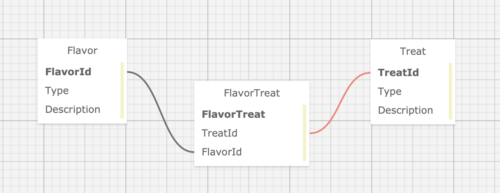

# _Pierre's Sweet and Savory Treats_

#### By _**Ian Bravo**_

#### _This web application will allow Pierre to manage his Treats and Flavors in an easy to use web application!_

## Technologies Used

* _C# 10.0_
* _HtmL_
* _css_
* _Bootstrap_
* _.Net 6.0_
* _ASP.NET Core MVC 6.0_
* _Entity Framework Core_
* _MySQL Community Server_


## Description

This C# web application will allow Pierre to view his treats and flavors. Pierre will be able to add/edit/delete both Treats and Flavors. However, non-authenticated users will only be allowed to view. Pierre can select a specific Treat to view it's type along with the Flavors that are associated to it. Pierre can also select a Flavor to view it's type and which Treats are associated to it. Pierre and non-authenticated users can view all Treats and Flavors on the Home page.

## Setup/Installation Requirements

Installing/Configuring MySQL:

1. Follow the instructions on this <a href="https://full-time-pre-october.learnhowtoprogram.com/c-and-net/getting-started-with-c/installing-and-configuring-mysql">page</a> for installing and configuring MySQL.


Installing dotnet-ef:
1. Run the following command to globally install dotnet-ef tools which will allow you to create migrations and create databases:    
   `$ dotnet tool install --global dotnet-ef --version 6.0.0`

Cloning the Repo:
1. Open the terminal.
2. Change your directory to where you would want the cloned directory.
3. Input the following command into your terminal:  
 `$ git clone https://github.com/ian-bravo/Bakeshop.Solution.git`
4. Using the terminal, navigate to the production directory: "Bakeshop" and create a new file called appsettings.json
5. Within appsettings.json, put in the following code while also replacing the following values with your own values as shown in the code snippet below:
```json
{
  "ConnectionStrings": {
      "DefaultConnection": "Server=localhost;Port=3306;database=[YOUR-DB-NAME];uid=[YOUR-USERNAME-HERE];pwd=[YOUR-PASSWORD-HERE];"
  }
}
```
* [YOUR-USERNAME-HERE] with your username
* [YOUR-PASSWORD-HERE] with your password
* [YOUR-DB-NAME] with the name of your database

Running the program:
1. Navigate to the project's production directory "Bakeshop" using the terminal.
2. Run the following command to update the database:    
  `$ dotnet ef database update`
3. Within the command line, run the command `$ dotnet watch run` to compile and execute the console application in developer mode.

## Schema



## Known Bugs

* _No known bugs_

## License

MIT License  

Copyright (c) 20-Oct-2023 Ian Bravo

Permission is hereby granted, free of charge, to any person obtaining a copy of this software and associated documentation files (the "Software"), to deal in the Software without restriction, including without limitation the rights to use, copy, modify, merge, publish, distribute, sublicense, and/or sell copies of the Software, and to permit persons to whom the Software is furnished to do so, subject to the following conditions:  

The above copyright notice and this permission notice shall be included in all copies or substantial portions of the Software.  

THE SOFTWARE IS PROVIDED "AS IS", WITHOUT WARRANTY OF ANY KIND, EXPRESS OR IMPLIED, INCLUDING BUT NOT LIMITED TO THE WARRANTIES OF MERCHANTABILITY, FITNESS FOR A PARTICULAR PURPOSE AND NONINFRINGEMENT. IN NO EVENT SHALL THE AUTHORS OR COPYRIGHT HOLDERS BE LIABLE FOR ANY CLAIM, DAMAGES OR OTHER LIABILITY, WHETHER IN AN ACTION OF CONTRACT, TORT OR OTHERWISE, ARISING FROM, OUT OF OR IN CONNECTION WITH THE SOFTWARE OR THE USE OR OTHER DEALINGS IN THE SOFTWARE.

_For questions or concerns, please email me at bravo.ian@gmail.com_